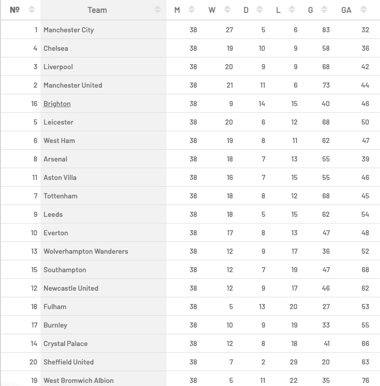

```{r setup, include=FALSE}
knitr::opts_chunk$set(echo = TRUE)
rm(list = ls())

library(tidyverse)
library(caret)
library(ggplot2)
library(ggpubr)
library(scales)
library(caret)
library(arm)
library(ROCR)
library(pROC); 
library(plotROC)
```

## Prep

*Imports*

```{r}
Bundesliga_shots_2019 <- read.csv("data/shots/Bundesliga_shots_2019.csv")
Bundesliga_shots_2020 <- read.csv("data/shots/Bundesliga_shots_2020.csv")
EPL_shots_2020 <- read.csv("data/shots/EPL_shots_2020.csv")
SerieA_shots_2020 <- read.csv("data/shots/SerieA_shots_2020.csv")
LaLiga_shots_2020 <- read.csv("data/shots/LaLiga_shots_2020.csv")
Ligue1_shots_2020 <- read.csv("data/shots/Ligue1_shots_2020.csv")
```

*Helper functions*

```{r}
# calculates shot angle
calc_angle <- function(X, Y){
  y <- as.matrix(c(X - 1, Y - 0.5))
  x <- t(as.matrix(c(-1, 0)))
  dot.prod <- x %*% y 
  norm.x <- norm(x, type="2")
  norm.y <- norm(y, type="2")
  theta <- acos(dot.prod / (norm.x * norm.y))
  return (as.numeric(theta) * (180 / pi))
}

'%ni%' <- Negate('%in%')
```

## MEDA

```{r}
# converts result to binary (1 - goal, 0 - miss) 
shots <- rbind(
  Bundesliga_shots_2020,
  EPL_shots_2020, 
  SerieA_shots_2020,
  LaLiga_shots_2020, 
  Ligue1_shots_2020) %>%
  mutate(result = ifelse(result == 'Goal', 1, 0))

# str(shots)
```

*Mapping the positions of shots.*

```{r}
shots %>%
  ggplot(.) + 
  geom_point(mapping = aes(x = X, y = Y, color = factor(result)), alpha = 0.3) +
  geom_point(mapping = aes(x = 0.5, y = 0.5), alpha = 1) +
  geom_text(aes(x = 0.5, y = 0.5, label = 'centre spot'), hjust = 0.5, vjust = -0.6) +
  geom_point(mapping = aes(x = 1, y = 0.5), alpha = 1) +
  geom_text(aes(x = 1, y = 0.5, label = 'goal [target]'), hjust = 0.8, vjust = -0.6) +
  scale_color_manual(labels = c('Miss', 'Goal'), values = c('coral', 'lightblue')) +
  scale_x_continuous(limits = c(0, 1), breaks = seq(0, 1, 0.1)) +
  scale_y_continuous(limits = c(0, 1), breaks = seq(0, 1, 0.1)) +
  labs(title = 'Every shot', color = 'Result')

shots %>%
  filter(result == 1) %>%
  ggplot(.) + 
  geom_point(mapping = aes(x = X, y = Y, color = factor(result)), alpha = 0.3) +
  scale_color_manual(labels = c('Goal'), values = c('lightblue')) +
  scale_x_continuous(limits = c(0, 1), breaks = seq(0, 1, 0.1)) +
  scale_y_continuous(limits = c(0, 1), breaks = seq(0, 1, 0.1)) +
  labs(title = 'Goals', color = 'Result')
```

To make our predictions more precise we filtered out shots from the range 0 < X < 0.5, since every goal comes from the opposite's half. There are 5 goals in our dataset in the range Y < 0.1 || Y > 0.9. After manually checking these 5 goals we decided to remove shots from this range, because the goals were conceded as a result of goalkeeper errors.

```{r}
shots <- shots %>%
  # filters out shots from over the half-way line and shots close to the sideline
  filter(X > 0.5, Y < 0.9 & Y > 0.1) %>%
  # calculates the distance
  mutate(distance = sqrt((1 - X)^2 + (0.5 - Y)^2))

# calculates shot angle
for(i in seq(1:nrow(shots))) {
  shots[i, 'shot_angle'] <- calc_angle(as.numeric(shots[i, 'X']), as.numeric(shots[i, 'Y']))
}

goals <- shots %>% filter(result == 1)
# str(shots)
```

### Distance

The combined boxplot below shows the distribution of goals and missed shots - we can see, that missed shots are distributed more evenly and most of the goals come from the penalty area (cca. distance < 1.5).

```{r}
shots %>%
  ggplot(., aes(x = factor(result), y = distance)) +
  geom_violin(aes(fill = factor(result))) +
  geom_boxplot(width = 0.1) +
  scale_y_continuous(breaks = seq(0, 1, 0.1)) +
  scale_fill_manual(labels = c('Miss', 'Goal'), values = c('coral', 'lightblue')) +
  labs(y = 'Distance', x = 'Result', fill = 'Result')
```

The histogram below shows the total of missed shots and goals. As we expected, the closer the shot is from the goal (target), the more likely it is going to be goal.

```{r}
shots %>%
  ggplot(., aes(x = distance, color = factor(result))) +
  scale_color_manual(labels = c('Miss', 'Goal'), values = c('coral', 'lightblue')) +
  geom_histogram(binwidth = 0.01) +
  labs(x = 'Distance', y = 'Count', color = 'Result')
```

*Mapping the position of goals based on shot type.*

```{r}
goals %>%
  ggplot(.) + 
  geom_point(mapping = aes(x = X, y = Y, color = factor(shotType)), alpha = 0.3) +
  scale_x_continuous(limits = c(0, 1), breaks = seq(0, 1, 0.1)) +
  scale_y_continuous(limits = c(0, 1), breaks = seq(0, 1, 0.1)) +
  labs(title = 'Goals', color = 'Shot type')
```

The type of the shot (head, left foot, right foot, or other body part) strongly affects the distribution of goals.

```{r}
goals %>%
  ggplot(., aes(x = factor(shotType), y = distance)) +
  geom_violin(aes(fill = factor(shotType))) +
  geom_boxplot(width = 0.1) +
  scale_y_continuous(breaks = seq(0, 1, 0.1)) +
  labs(y = 'Distance', x = 'Shot type', fill = 'Shot type')
```

### Shot angle

The histogram below shows the distribution of shots based on the angle of the shot. Missed shots are more evenly distributed compared to goals: 25% of goals has a shot angle smaller than 15.8&deg;. We can see that a lot of goals is in the range: <0&deg;, 5&deg;>

```{r}
# every shot
quantiles <- quantile(shots$shot_angle)
# quantiles

shots %>%
  ggplot(., aes(x = shot_angle)) +
  geom_histogram(aes(y = ..density..), binwidth = 5, colour = 'grey') +
  geom_density(color='darkblue', fill='lightblue', alpha = 0.5) +
  geom_vline(xintercept = quantiles[2:4], colour = 'red', linetype ='longdash') +
  labs(title = 'Every shot', x = 'Shot angle', y = 'Count', fill = 'Result') +
  scale_x_continuous(limits = c(-10, 90), breaks = seq(0, 90, 5))

# goals
quantiles <- quantile(goals$shot_angle)
# quantiles

goals %>%
  ggplot(., aes(x = shot_angle)) +  # fill = factor(shotType)
  geom_histogram(aes(y = ..density..), binwidth = 5, colour = 'grey') +
  geom_density(color='darkblue', fill='lightblue', alpha = 0.5) +
  geom_vline(xintercept = quantiles[2:4], colour = 'red', linetype ='longdash') +
  labs(title = 'Goals', x = 'Shot angle', y = 'Count', fill = 'Result') +
  scale_x_continuous(limits = c(-10, 90), breaks = seq(0, 90, 5))
```

## Logistic regression

We used logistic regression to predict the outcome of a shot.

### Data preparation

```{r}
# train + test dataset
shots <- rbind(
  Bundesliga_shots_2020, 
  EPL_shots_2020, 
  SerieA_shots_2020, 
  LaLiga_shots_2020, 
  Ligue1_shots_2020) %>%
  filter(X > 0.5, Y < 0.9) %>%
  mutate(distance = sqrt((1 - X)^2 + (0.5 - Y)^2)) %>%
  # since shot types 'Head' and 'OtherBodyPart' had similar characteristics, we combined them
  mutate(shotType = ifelse(shotType == 'OtherBodyPart', 'Head', shotType)) %>%
  mutate(Class = ifelse(result == 'Goal', 1, 0))
shots$Class <- factor(shots$Class, levels = c(0, 1))
shots$situation <- as.factor(shots$situation)
shots$shotType <- as.factor(shots$shotType)
for(i in seq(1:nrow(shots))) {
  shots[i, 'shot_angle'] <- calc_angle(as.numeric(shots[i, 'X']), as.numeric(shots[i, 'Y']))
}

# validation dataset
validationShots <- rbind(Bundesliga_shots_2019) %>%
  filter(X > 0.5, Y < 0.9) %>%
  mutate(distance = sqrt((1 - X)^2 + (0.5 - Y)^2)) %>%
  mutate(shotType = ifelse(shotType == 'OtherBodyPart', 'Head', shotType)) %>%
  mutate(Class = ifelse(result == 'Goal', 1, 0))
validationShots$Class <- factor(validationShots$Class, levels = c(0, 1))
validationShots$situation <- as.factor(validationShots$situation)
validationShots$shotType <- as.factor(validationShots$shotType)
for(i in seq(1:nrow(validationShots))) {
  validationShots[i, 'shot_angle'] <- calc_angle(
    as.numeric(validationShots[i, 'X']),
    as.numeric(validationShots[i, 'Y']))
}
```

*Creating training and testing datasets.* Considering that the amount of missed shots is much higher the the amount of goals (cca. 1:7), we had to downsample missed shots to eliminate distortion in training.

```{r}
set.seed(44)

sample <- sample(c(TRUE, FALSE), nrow(shots), replace = T, prob = c(0.7, 0.3))
trainShots <- shots[sample, ]
testShots <- shots[!sample, ]

# downsamples missed shots
trainShots <- downSample(x = trainShots[, colnames(trainShots) %ni% 'Class'], 
                         y = trainShots$Class)

# table(trainShots$Class)
```

### Building the model

Based on the exploratory data analysis we decided to use the distance and angle of the shot in our model, as well as the situation and the type of the shot. The summary shows that the model has good fit: most importantly the deviance residuals are balanced and the p-value is lower than 0.05 (at every parameter).

```{r}
# builds the model
set.seed(44)
model <- glm(Class ~ distance + shot_angle + situation + shotType, 
             data = trainShots, 
             family = 'binomial')

summary(model)
```

*Chosing the threshold using ROC.* We decided to go with higher specificity (true negative rate): 0.85.

```{r}
invisible(plot(
  roc(trainShots$Class, fitted(model)), 
  print.thres = c(0.55, 0.7, 0.85), 
  col = 'red', 
  print.auc = T))

# (specificity, sensitivity)
```
### Testing the model

```{r}
# creates predictions for the test data
testShots$pred <- predict(model, newdata = testShots, type = 'response')
```

The confusion matrix below shows how our model predicts the outcome of shots.

```{r}
# confusionMatrix(factor(ifelse(testShots$pred > 0.55, 1, 0)), testShots$Class)$table
# confusionMatrix(factor(ifelse(testShots$pred > 0.7, 1, 0)), testShots$Class)$table
confusionMatrix(factor(ifelse(testShots$pred > 0.85, 1, 0)), testShots$Class)$table
```

```{r}
# tests prediction accuracy
y_pred_num <- ifelse(testShots$pred > 0.85, 1, 0)
y_pred <- factor(y_pred_num, levels = c(1, 0))
mean(y_pred == testShots$Class)
```


```{r}
binnedplot(fitted(model), 
           residuals(model, type = "response"), 
           nclass = NULL, 
           xlab = "Expected Values", 
           ylab = "Average residual", 
           main = "Binned residual plot", 
           col.int = "gray")
```

*Plotting the prediction.*

```{r}
prediction <- data.frame(probability = model$fitted.values, result = trainShots$Class)
 
prediction <- prediction[order(prediction$probability, decreasing = FALSE), ]
prediction$rank <- 1:nrow(prediction)

prediction %>%
  ggplot(., aes(x = rank, y = probability)) +
  geom_point(aes(color = result), alpha = 0.2) +
  scale_color_manual(labels = c('Miss', 'Goal'), values = c('coral', 'lightblue')) +
  xlab('Index') +
  ylab('Predicted probability of goals')
```

### Validation

We used shots from a different season (2019/2020) as validation dataset.

```{r}
# create prediction
validationShots$pred <- predict(model, newdata = validationShots, type = 'response')

# test the accuracy of our prediction
y_pred_num <- ifelse(validationShots$pred > 0.85, 1, 0)
y_pred <- factor(y_pred_num, levels = c(1, 0))

mean(y_pred == validationShots$Class)
```

## Evaluation

### The accuracy of the model

The fact that goals in football are rare events makes it much harder to predict the outcome of a shot than in any other sport. In our validation dataset we have 1095 goals and 7053 missed shots, which means that if we would predict that every shot is a miss, the accuracy of our prediction would be 86,5%. Compared to this, the accuracy of our model was 88,4%, therefore the improvement is only 1,9%.

The outcome of a shot in football is heavily influenced by randomness. The original idea behind the xG model was to create a metric, that describes the situation (the shot) more precisely. The same thing is true in our case: even if the model can not predict the outcome of a shot accurately, it can reveal dangerous shots.

To illustrate how xG works, we can compare the predictions on understat.com for this year's season in Premier League with the final results. Based on the xG metric, Brighton should be on the 5th place in the league, however they are 16th. This means that Brighton either wasted their chances or they were simply unlucky. 



This means that our model can be used mainly to show how dangerous a shot is, and not for predicting it's outcome.

### Comparison with the xG model

We can predict the outcome of shots in our validation dataset using the xG metric from Understat. For 0.5 threshold it shows 91,4% accuracy.

```{r}
# test xG accuracy
y_xG_num <- ifelse(validationShots$xG > 0.5, 1, 0)
y_xG_pred <- factor(y_xG_num, levels = c(1, 0))
mean(y_xG_pred == validationShots$Class)
```

On the graph below we can see the difference between our model and the xG. We can see that our model overevaluates shots (with cca. 0.27) compared to the xG model.

```{r}
validationShots <- validationShots %>% mutate(serial = row_number())

validationShots %>%
  ggplot(., aes(x = serial)) +
  geom_line(aes(y = xG - pred, color = 'red'), alpha = 0.5) +
  geom_hline(yintercept = mean(validationShots$xG - validationShots$pred), 
             colour = 'blue', 
             linetype ='longdash') +
  xlab("id") +
  ylab("xG - prediction") +
  scale_y_continuous(limits = c(-1, 1), breaks = seq(-1, 1, 0.1))

# mean(validationShots$xG - validationShots$pred)
```

The graphs below show the correlation between our prediction and Understat's xG. We can see that our model evaluates smaller chances (under 0.2 xG) slightly differently than Understat's model.

```{r}
validationShots %>%
  ggplot(., aes(x = xG, y = pred)) + 
  geom_point() +
  geom_smooth(method = lm)  # formula = y ~ poly(x, 2)

validationShots %>%
  mutate(corr = ifelse(xG < 0.2, 1, 2)) %>%
  ggplot(., aes(x = xG, y = pred, color = factor(corr))) + 
  geom_point() +
  geom_smooth(method = lm)
```

```{r}
validationShots %>%
  ggplot(.) + 
  geom_point(mapping = aes(x = X, y = Y, color = xG), alpha = 0.3) +
  scale_x_continuous(limits = c(0, 1), breaks = seq(0, 1, 0.1)) +
  scale_y_continuous(limits = c(0, 1), breaks = seq(0, 1, 0.1)) +
  labs(title = 'xG model', color = 'xG')

validationShots %>%
  ggplot(.) + 
  geom_point(mapping = aes(x = X, y = Y, color = pred), alpha = 0.3) +
  scale_x_continuous(limits = c(0, 1), breaks = seq(0, 1, 0.1)) +
  scale_y_continuous(limits = c(0, 1), breaks = seq(0, 1, 0.1)) +
  labs(title = 'Our prediction', color = 'pred')
```

Different xG models (eg. Opta's xG, InfoGoal's xG) use different methods, therefore it is not unusual to get different predictions.

Our dataset does not provide deeper understanding of the situation. Other xG models use more precise data that contains more detailed information, such as the speed of the shot or the number of defensive players between the ball and the goal. This might be one of the reasons why our model over overevaluates some shots, compared to Understat's xG. 

